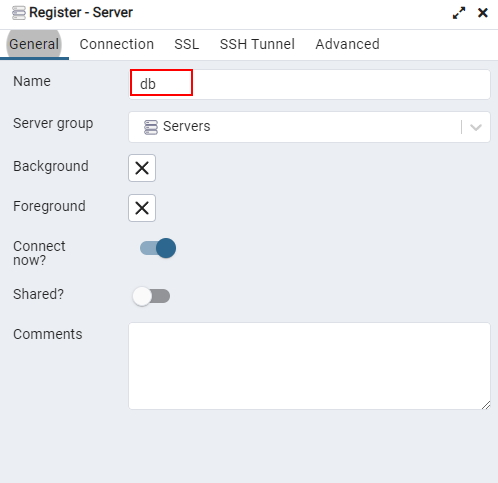
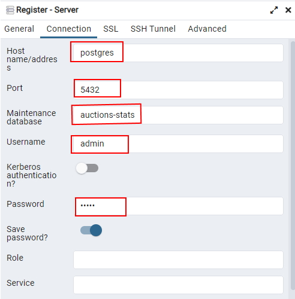

# Установка и запуск контейнеров Docker

  
- скачиваем и устанавливаем [Docker Desktop](https://www.docker.com/)
- запускаем PowerShell
- с помощью команды `cd [путь до папки docker]` переходим в папку со скриптами запуска
- вводим команду `.\build_run.ps1` ждем когда скачаются и установятся образы
- запускаем любимый браузер и переходим на страницу http://localhost:15432/ 
> ссылка может открыться не сразу контейнерам надо время на запуск.  Если ссылка не открылась подождать 10-15 секунд и попробовать снова.

- Вводим логин: admin@example.com
Пароль: admin
- кликаем "Add new server"
- вводим следующие параметры:

Имя пользователя и пароль совпадают.

- Жмем Save

